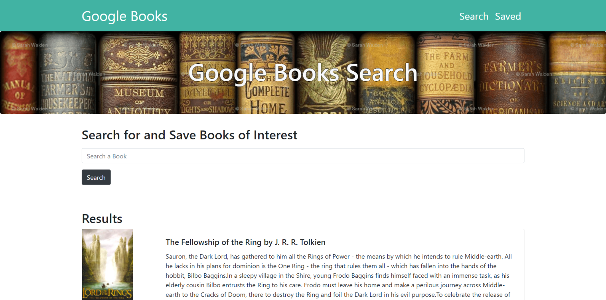

# Google Books Search

This application uses the MERN model (MongoDB, Express, React, Node) to create an app that allows the user to search for a save books of interest.

## Example

---
## Links

Video Demo: https://youtu.be/zWglRrm34BE

Live App: https://google-book-search-jl.herokuapp.com/

Github Repository: https://github.com/Valborg1/google-books-search